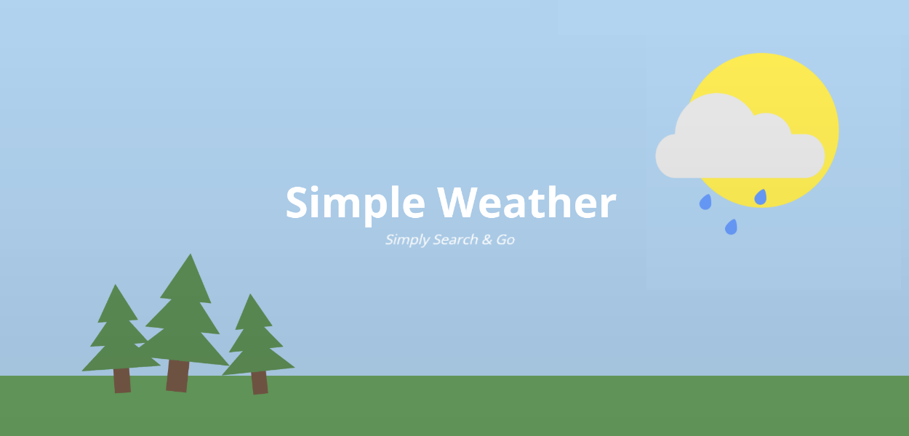
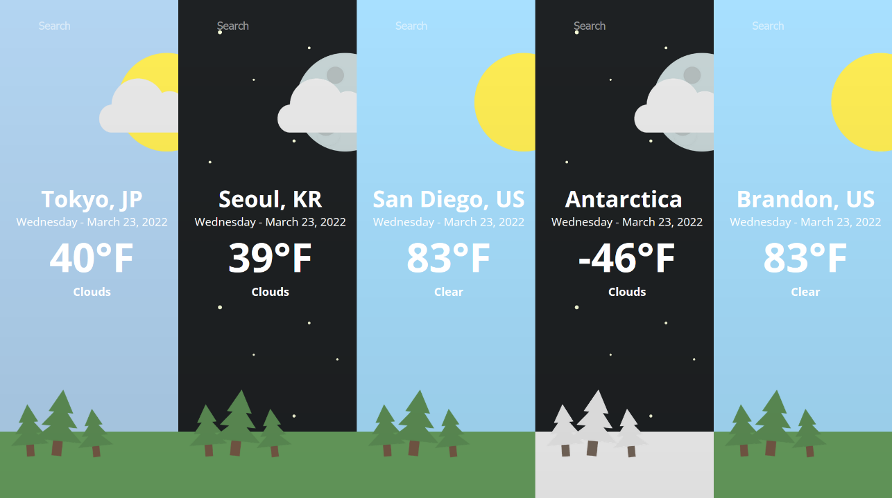

Written in ReactJS and powered by the OpenWeatherMap API, simply type in a location & the app will display the current date & weather alongside cute graphics, dynamically updated based on the time of day and weather conditions.

## **[Try it out!](https://www.benjibenji.com/simple-weather/)**

