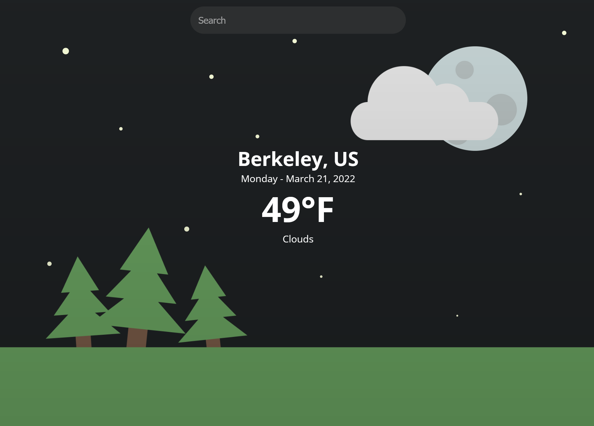

# Simple Weather
Simple Weather is just that, a *simple weather app.*

Written in ReactJS, simply type in a location & the app will display the current date & weather alongside cute graphics, dynamically updated based on the time of day, weather conditions, and so on.

**Check it out [here!](https://www.benjibenji.com/simple-weather/)**

### Preview

